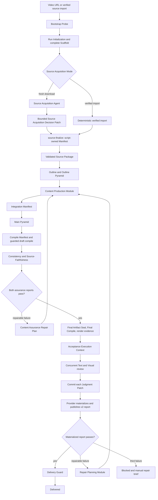

# Video Workflow Kernel 2.0 decision map

This document is a navigation, implementation-orientation, and component activation-status view. `CONTEXT-MAP.md` routes vocabulary to its owning context glossary, and the numbered ADRs remain authoritative for individual decisions. Under ADR 0050, target-design presence does not imply runtime activation.

## Core conclusion

Deterministic workflow mechanics belong to one script-owned Video Workflow Kernel. Semantic interpretation belongs to isolated subagents that receive immutable Task Envelopes and return bounded Judgment Patches. Provider scripts validate and materialize every governed report before a checkpoint can advance.

## Component activation status

This table records current executable authority as of 2026-07-14. Status applies to components and contracts; a context may contain both active Legacy language and accepted target-only language.

| Component or contract | Status | Current authority | Activation event |
|---|---|---|---|
| Bilibili render workflow | `active_legacy` | `AGENTS.md`, `CLAUDE.md`, current Bilibili skill, validators, and guards | Bilibili Platform Kernel Cutover |
| YouTube render workflow | `active_legacy` | `AGENTS.md`, `CLAUDE.md`, current YouTube skill, validators, and guards | YouTube Platform Kernel Cutover |
| Pyramid validation in current render skills | `active_legacy` | Current Pyramid skill, schemas, and gate reports | Applicable Platform Kernel Cutover for Kernel-issued tasks |
| Legacy Final Acceptance and Acceptance Report v1 | `active_legacy` | Current Final Acceptance skill, criteria, report contract, and Delivery Guard integration | Global Gate Cutover |
| Current Delivery Guard and session-scoped delivery targets | `active_legacy` | Current guard scripts, target records, hooks, and tests | Global Gate Cutover for v2 report consumption; later platform cutovers for Run ownership |
| Acceptance Report v2 and dual Reviewer execution | `target_only` | ADRs 0028–0031, 0041, 0051, and 0056 | Global Gate Cutover |
| Video Workflow Kernel core and Workflow CLI | `target_only` | ADRs 0008–0027 and planned schemas/providers | First validated Platform Kernel Cutover |
| Kernel Gate Provider adapters | `target_only` | ADRs 0024–0027 and provider executable contracts | Owning Global or Platform Cutover |
| Bilibili Video Platform Adapter | `target_only` | ADRs 0008, 0011, 0018–0019, and 0040 | Bilibili Platform Kernel Cutover |
| YouTube Video Platform Adapter | `target_only` | ADRs 0008, 0011, 0018–0019, and 0040 | YouTube Platform Kernel Cutover |
| Resource Admission and Batch projection | `target_only` | ADRs 0035–0037 and 0042–0047 | Batch Cutover |

No component currently has `active_global_gate` or `active_kernel` status.

## Authority boundaries

| Authority | Owns | Excludes |
|---|---|---|
| `workflow/run.json` | one Run's identity, phase, checkpoints, generations, dependencies, delivery references | cross-run resource CAS |
| `workspace/.workflow-control/control.sqlite3` | path bindings; Claims; resource and scheduler state; Run, Acceptance, and projection slots; initialization, promotion, acceptance-publication, and delivery Mutation Intents | artifact contents, per-run lifecycle, module-local execution state, and gate decisions |
| Acceptance Execution Context | Final Acceptance task identities, committed Patch generations, provider publication state | Run lifecycle, delivery ownership, semantic decision |
| Gate Provider report | one gate's validated semantic or mechanical decision | workflow coordination |
| Acceptance Report v2 | sole machine-readable final acceptance decision | Delivery Guard mechanics |
| Delivery Guard report | freshness, provenance, paths, manifest and report validity | semantic quality judgment |
| Batch Record | source selection, item order, run mapping and projections | per-video state mutation and success authority |

## Decision groups

### Kernel and state

- ADR 0008: one Kernel with Platform Adapters.
- ADR 0009–0010: per-video Run Record plus checkpoint graph.
- ADR 0020–0023: envelopes, claims, generations, SHA-256 freshness, and versioned contracts.
- ADR 0042–0047: hybrid JSON/SQLite authority, quota edge cases, reservation ordering, lease fencing, serial promotion, and database sidecar policy.
- ADR 0054–0055: fail-closed Control Store recovery and coordinated delivery projections.

### Source and workspace

- ADR 0011–0013: dedicated Source Acquisition Agent, two-phase bootstrap, and earliest-valid artifact creation.
- ADR 0014–0016: deterministic directory scaffold and Windows path budget.
- ADR 0017–0019: independent run/version identity, fresh-download default, verified source import, and script-owned Source Manifest.

### Semantic production and review

- ADR 0026–0027: immutable Skeleton plus Judgment Patch, and prompt/mechanics separation.
- ADR 0032–0034: deep production orchestration, bounded figure waves, and parallel Content Assurance.
- ADR 0048: declared Compile Manifest with recorder-proven dependency closure.
- ADR 0052–0053: Content Assurance repair closure plus final sealing, compile, and render evidence.

### Final acceptance and repair

- ADR 0028–0030: Text/Visual dimensions, cross-dimension failure dominance, Acceptance Report v2, and v1 retirement.
- ADR 0031: deterministic conflict-aware repair planning.
- ADR 0041: versioned Acceptance Dimension Map while Criteria v1 remains unchanged.
- ADR 0051: Global Acceptance v2 cutover with a Legacy Acceptance Input Set.
- ADR 0056: Run-independent Acceptance Execution Context with independently committed Reviewer Patches.

### Batch and capacity

- ADR 0035–0037: fixed Resource Classes, Batch as a projection, and deterministic fair scheduling.
- ADR 0043–0045: quota downshift, disjoint reservations, and lease resolution separated from claim reclaim.

### Rollout

- ADR 0038–0039: offline `source_ready` tracer bullet and three public test seams.
- ADR 0040: Bilibili, YouTube, then Batch atomic cutovers.
- ADR 0049: thirteen vertical implementation slices.
- ADR 0050: accepted target design remains inactive until a validated cutover.

### Domain documentation

- ADR 0057: `CONTEXT-MAP.md` routes four active contexts and one supporting context while the global ADR ledger remains stable.

## Canonical new-run layout

The Kernel creates every governed directory, including `workflow/tasks/`, `source/`, `figures/`, `work/`, `review/`, and `待删除/`. Agents receive existing paths and never invent the scaffold. Version 2 and later deliverables have visible version identity; a v2 run may use `source_only` and does not require a prior delivered PDF.

## Atomic activation groups

Build completion and runtime activation are separate. The following activation surfaces change together:

1. Global Gate Cutover: Acceptance v2 schema, Dimension Map, criterion index, two Judgment Patch schemas, Legacy Input Set, Acceptance Execution Context, Task Authority Binding, per-Patch commit, report-publication intent, Skeleton, materializer, validator, Delivery Guard, both Legacy skills, instructions, mirrored `.claude` files, and tests.
2. Bilibili Platform Kernel Cutover: Bilibili adapter, scaffold and task ownership, production and compile providers, Bilibili skill/instructions, final evidence, lifecycle integration, policy checks, and tests.
3. YouTube Platform Kernel Cutover: the corresponding YouTube adapter and ownership surfaces after Bilibili evidence passes.
4. Batch Cutover: Batch Supervisor, Batch projections, Batch skill, recovery tests, and removal of global `--concurrency`, free-form child workflows, and PDF-existence success. Resource Admission is already implemented and tested before live single-video providers.
5. Each cutover requires a schema-valid Exit Evidence Manifest; inactive provider code and schemas cannot claim authority merely because they exist.

## Explicitly deferred

- historical workspace and Run Record migration implementation;
- weighted, critical-path, or adaptive scheduling;
- WAL, distributed queues, and cross-machine execution;
- Visual Acceptance page sharding;
- Acceptance Report v1 compatibility or mechanical migration;
- strong hostile-TeX operating-system sandboxing;
- runtime automatic source-package reuse;
- dynamic unlimited Figure waves.

## Principal implementation risks

1. Windows multi-file publication and JSON/SQLite Saga recovery require exhaustive fault injection.
2. Compile Manifest closure must cover real local classes, fonts, bibliography, figures, and generated auxiliaries before platform cutover.
3. Acceptance v2 activation has a wide atomic update set and must reject every remaining v1 authority path.
4. Existing `.agents` and `.claude` workflow copies can drift unless an executable policy check compares required contracts.
5. Unknown Resource Leases may intentionally block capacity until termination evidence or human resolution exists.
6. Control Store restore and multi-file delivery lifecycle reconciliation are shared fail-closed paths that require regular fault drills.
