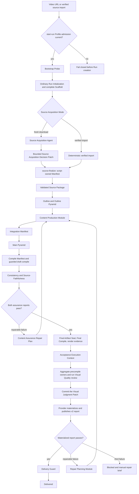

# Video Workflow Kernel 2.0 decision map

This document is a navigation, implementation-orientation, and component activation-status view. `CONTEXT-MAP.md` routes vocabulary to its owning context glossary, and the numbered ADRs remain authoritative for individual decisions. Under ADR 0050, target-design presence does not imply runtime activation.

## Core conclusion

Deterministic workflow mechanics belong to one script-owned Video Workflow Kernel. Semantic interpretation belongs to isolated subagents that receive immutable Task Envelopes and return bounded Judgment Patches. Provider scripts validate and materialize every governed report before a checkpoint can advance.

## Component activation status

This table records current executable authority as of 2026-08-28. The Workflow Release Profile is the sole ordinary-admission authority for completed Workflow 2.0 capabilities. Bilibili and YouTube are `active_kernel` for new tasks through `start-run --project-config`; Batch is `active_batch` for new batches through `batch-plan --project-config`. Both routes require the committed Cutover Authority Tombstone and current Profile activation. Existing directories retain explicit Legacy maintenance. Historical Slice 12, Slice 13, and Slice 14 evidence remains release history.

| Component or contract | Status | Current authority | Activation event |
|---|---|---|---|
| Bilibili render workflow for new Runs | `active_kernel` | Profile-backed `start-run`, Bilibili adapter, Kernel Run Record and delivery lifecycle, Bilibili skill semantics | Active through the Workflow Release Profile |
| Existing Bilibili directories | `active_legacy` | Run-record-free Legacy Acceptance Input Set and explicit Legacy coordination | Explicit historical Run migration |
| YouTube render workflow for new Runs | `active_kernel` | Profile-backed `start-run`, YouTube adapter, Kernel Run Record and delivery lifecycle, YouTube skill semantics | Active through the Workflow Release Profile |
| Pyramid validation in current render skills | track-scoped | Current Pyramid skill, schemas, and gate reports | Kernel-issued tasks use Kernel coordination; existing directories retain Legacy coordination |
| Legacy Final Acceptance and Acceptance Report v1 | superseded | Historical evidence only; rejected by the active Guard | Completed Global Gate Cutover |
| Current Delivery Guard and session-scoped delivery targets | `active_global_gate` | Acceptance Report v2 plus committed execution, Patch, report, gate, and fingerprint authority | Active; policy evidence refresh preserves the stable base Global Gate authority |
| Delivery Quality Rule Catalog, Language Profiles, Role Projections, Waivers, migration ledger, conformance, precompile quality, and text sealing | `active_global_gate` | Canonical Delivery Quality contracts and public commands | Active |
| Acceptance Report v2, precompile-owner aggregation, independent Visual Quality review, and Run-record-free Legacy Final Compile | `active_global_gate` | ADRs 0028–0031, 0041, 0051, 0056, 0063, 0064, and 0066 | Active |
| Video Workflow Kernel core and Workflow CLI | `active_kernel` | `scripts/video_workflow.py`, `src/video2pdf_workflow_kernel/`, registered Kernel schemas, ADRs 0008–0027 | Active for new Bilibili and YouTube Runs |
| Kernel Gate Provider adapters | `active_kernel` | Registered provider executable contracts, including Pyramid bindings and guarded compile | Active for their owning platform authority |
| Bilibili Video Platform Adapter | `active_kernel` | ADRs 0008, 0011, 0018–0019, and 0040 | Active through Profile capability `bilibili` |
| YouTube Video Platform Adapter | `active_kernel` | ADRs 0008, 0011, 0018–0019, and 0040 | Active through Profile capability `youtube` |
| Resource Admission and Batch projection | `active_batch` | ADRs 0035–0037 and 0042–0047 | Active through Profile capability `batch` |

The shared final-quality gate has `active_global_gate` status. Bilibili and YouTube have `active_kernel` status for new Runs, and Batch has `active_batch` status for new batches. Delivery Quality Slices A-D supply the active global quality policy, precompile assurance, final evidence, Acceptance Report v2, and Guard eligibility for Kernel and Legacy inputs. ADR 0066 makes the shared Guarded Final Compile provider operational for an explicitly named Run-record-free Legacy video root without granting Kernel lifecycle authority. The Global Gate policy-authority refresh advances the committed Exit Evidence identity in the policy overlay while preserving the existing `active_global_gate.json` bytes, generation, Acceptance Report v2 authority, and platform authority. Existing Bilibili and YouTube directories retain Legacy platform coordination unless explicit migration authority is introduced.

The completed Bilibili cold start used `platform-kernel-prepare` and `init-cutover-candidate` to bind one exact evidence candidate while ordinary `init-run` was closed. `platform-kernel-candidate-activate` required that candidate to be `ready_for_delivery` with a provider-current passing Acceptance Report v2 and produced candidate-only `PROVISIONAL` continuation authority. The candidate advanced to `accepted`, obtained a fresh current Delivery Guard, reached `delivered`, and published validated evidence. `platform-kernel-activate` then confirmed the matching delivered candidate and opened ordinary Bilibili initialization.

Canonical order: `PREPARED` -> `INITIALIZED` -> `source_ready` -> `ready_for_delivery` with a provider-current passing Acceptance Report v2 -> `PROVISIONAL` -> `accepted` -> fresh current Delivery Guard -> `delivered` -> published Slice 12 Exit Evidence -> `CONFIRMED`.

The completed cutover candidate used the public `source-acquire` command against its existing `--run-dir`; source evidence remained attached to that same Run and no second Run was created.

When no usable CC subtitle exists, `source-acquire` must stage Whisper output through the Kernel-issued Whisper Task/Attempt and promote the validated Attempt before `source_ready` becomes current.

Source acquisition must never call `source-live-smoke`; no second Run may be created for source acquisition.

An expired or rejected Cookie is a recoverable `user_input` Source Blocker: preserve the same Run and its evidence, do not count it as a delivery attempt failure, and immediately request a refreshed Cookie from the user.

After receiving the refreshed Cookie, close the source circuit breaker, run `source-blocker-resolve`, and retry `source-acquire` on the same Run with a new `source_epoch`.

The Cookie path and Cookie contents are credential-bearing secrets and must never appear in logs, reports, shared evidence, or task prompts.

If acquisition is interrupted after terminal proof persistence and before Resource Lease release, run `source-acquire-reconcile --run-dir <run-dir>`.

`source-acquire-reconcile` reloads the persisted terminal proof, releases the existing Lease, and advances or retries the interrupted Task on the same Run; it must not initialize or attach another Run.

```mermaid
flowchart TD
    U["Video URL or verified source import"] --> SR{"start-run Profile admission current?"}
    SR -->|"yes"| BP["Bootstrap Probe"]
    SR -->|"no"| FC["Fail closed before Run creation"]
    BP --> IR["Ordinary Run Initialization and complete Scaffold"]
    IR --> SM{"Source Acquisition Mode"}
    SM -->|"fresh download"| SA["Source Acquisition Agent"]
    SM -->|"verified import"| VI["Deterministic verified import"]
    SA --> SD["Bounded Source Acquisition Decision Patch"]
    SD --> SF["source-finalize: script-owned Manifest"]
    VI --> SF
    SF --> SP["Validated Source Package"]
    SP --> OP["Outline and Outline Pyramid"]
    OP --> CP["Content Production Module"]
    CP --> IP["Integration Manifest"]
    IP --> MP["Main Pyramid"]
    MP --> CM["Compile Manifest and guarded draft compile"]
    CM --> CA["Consistency and Source-Faithfulness"]
    CA --> CAP{"Both assurance reports pass?"}
    CAP -->|"repairable failure"| AR["Content Assurance Repair Plan"]
    AR --> CP
    CAP -->|"yes"| FE["Final Artifact Seal, Final Compile, render evidence"]
    FE --> AX["Acceptance Execution Context"]
    AX --> FA["Aggregate precompile owners and run Visual Quality review"]
    FA --> PC["Commit the Visual Judgment Patch"]
    PC --> AM["Provider materializes and publishes v2 report"]
    AM --> RP{"Materialized report passes?"}
    RP -->|"yes"| DG["Delivery Guard"]
    RP -->|"repairable failure"| RM["Repair Planning Module"]
    RM --> CP
    RP -->|"third failure"| BL["Blocked and manual repair brief"]
    DG --> DL["Delivered"]
```

## Authority boundaries

| Authority | Owns | Excludes |
|---|---|---|
| `workflow/run.json` | one Run's identity, phase, checkpoints, generations, dependencies, delivery references | cross-run resource CAS |
| `workspace/.workflow-control/control.sqlite3` | path bindings; Claims; resource and scheduler state; Run, Acceptance, and projection slots; initialization, promotion, acceptance-publication, and delivery Mutation Intents | artifact contents, per-run lifecycle, module-local execution state, and gate decisions |
| Acceptance Execution Context | Final Acceptance task identities, committed Patch generations, provider publication state | Run lifecycle, delivery ownership, semantic decision |
| Gate Provider report | one gate's validated semantic or mechanical decision | workflow coordination |
| Acceptance Report v2 | sole machine-readable final acceptance decision | Delivery Guard mechanics |
| Delivery Guard report | freshness, provenance, paths, manifest and report validity | semantic quality judgment |
| Batch Record | source selection, item order, run mapping and projections | per-video state mutation and success authority |

## Decision groups

### Kernel and state

- ADR 0008: one Kernel with Platform Adapters.
- ADR 0009–0010: per-video Run Record plus checkpoint graph.
- ADR 0020–0023: envelopes, claims, generations, SHA-256 freshness, and versioned contracts.
- ADR 0042–0047: hybrid JSON/SQLite authority, quota edge cases, reservation ordering, lease fencing, serial promotion, and database sidecar policy.
- ADR 0054–0055: fail-closed Control Store recovery and coordinated delivery projections.

### Source and workspace

- ADR 0011–0013: dedicated Source Acquisition Agent, two-phase bootstrap, and earliest-valid artifact creation.
- ADR 0014–0016: deterministic directory scaffold and Windows path budget.
- ADR 0017–0019: independent run/version identity, fresh-download default, verified source import, and script-owned Source Manifest.

### Semantic production and review

- ADR 0026–0027: immutable Skeleton plus Judgment Patch, and prompt/mechanics separation.
- ADR 0032–0034: deep production orchestration, bounded figure waves, and parallel Content Assurance.
- ADR 0048: declared Compile Manifest with recorder-proven dependency closure.
- ADR 0052–0053: Content Assurance repair closure plus final sealing, compile, and render evidence.
- ADR 0067: recorder-derived, resumable Compile Runtime successor publication.

### Final acceptance and repair

- ADR 0028–0030: Text/Visual dimensions, cross-dimension failure dominance, Acceptance Report v2, and v1 retirement.
- ADR 0031: deterministic conflict-aware repair planning.
- ADR 0041: versioned Acceptance Dimension Map while Criteria v1 remains unchanged.
- ADR 0051: Global Acceptance v2 cutover with a Legacy Acceptance Input Set.
- ADR 0056: Run-independent Acceptance Execution Context with independently committed Reviewer Patches.

### Batch and capacity

- ADR 0035–0037: fixed Resource Classes, Batch as a projection, and deterministic fair scheduling.
- ADR 0043–0045: quota downshift, disjoint reservations, and lease resolution separated from claim reclaim.

### Rollout

- ADR 0038–0039: offline `source_ready` tracer bullet and three public test seams.
- ADR 0040: Bilibili, YouTube, then Batch atomic cutovers.
- ADR 0049: thirteen vertical implementation slices.
- ADR 0050: accepted target design remains inactive until a validated cutover.

### Domain documentation

- ADR 0057: `CONTEXT-MAP.md` routes four active contexts and one supporting context while the global ADR ledger remains stable.

## Canonical new-run layout

The Kernel creates every governed directory, including `workflow/tasks/`, `source/`, `figures/`, `work/`, `review/`, and `待删除/`. Agents receive existing paths and never invent the scaffold. Version 2 and later deliverables have visible version identity; a v2 run may use `source_only` and does not require a prior delivered PDF.

## Atomic activation groups

Build completion and runtime activation are separate. Coordinated Profile activation now publishes the compatible Profile, retires machine-local cutover state, commits the Tombstone, activates both ordinary admission routes, and releases one project maintenance fence only after operator contracts agree. The historical activation groups remain preserved below:

1. Global Gate Cutover — completed by ADR 0064: Acceptance v2 schemas, Legacy Input Set, Acceptance Execution Context, task authority, Patch/report publication, materializer, validator, Delivery Guard, skills, instructions, mirrors, and tests now form the active global gate. Subsequent policy-authority refreshes publish current Exit Evidence through the separate policy overlay and leave the stable base Global Gate authority unchanged. The refreshed qualification contract covers the complete policy-refresh and Issue 41 modules, public modern Legacy adoption and Guard positive/negative cases, all affected complete modules, and fingerprints every implementation path changed since the stable Slice 11 base commit.
2. Bilibili Platform Kernel Cutover — historical: the completed cold-start publication passed through one `PREPARED`/`INITIALIZED` candidate, candidate-only `PROVISIONAL` delivery completion, published Slice 12 Exit Evidence, and final `CONFIRMED` authority. Its machine-local admission authority is retired; the Profile capability now opens new Bilibili Runs.
3. YouTube Platform Kernel Cutover — historical: published Slice 13 Exit Evidence remains release history. Its machine-local admission authority is retired; the Profile capability now opens new YouTube Runs.
4. Batch Cutover — historical: published Slice 14 Exit Evidence remains release history. The Profile capability now opens new Batch planning. Resource Admission still governs live providers, and pre-existing Legacy batch directories retain the Legacy driver.
5. Each cutover requires a schema-valid Exit Evidence Manifest; inactive provider code and schemas cannot claim authority merely because they exist.

## Explicitly deferred

- historical workspace and Run Record migration implementation;
- weighted, critical-path, or adaptive scheduling;
- WAL, distributed queues, and cross-machine execution;
- Visual Acceptance page sharding;
- Acceptance Report v1 compatibility or mechanical migration;
- strong hostile-TeX operating-system sandboxing;
- runtime automatic source-package reuse;
- dynamic unlimited Figure waves.

## Principal implementation risks

1. Windows multi-file publication and JSON/SQLite Saga recovery require exhaustive fault injection.
2. Compile Manifest closure must cover real local classes, fonts, bibliography, figures, and generated auxiliaries before platform cutover.
3. Acceptance v2 activation has a wide atomic update set and must reject every remaining v1 authority path.
4. Existing `.agents` and `.claude` workflow copies can drift unless an executable policy check compares required contracts.
5. Unknown Resource Leases may intentionally block capacity until termination evidence or human resolution exists.
6. Control Store restore and multi-file delivery lifecycle reconciliation are shared fail-closed paths that require regular fault drills.
