# Issue Dependency View: delivery-glossary-terminology-governance

## Consistency errors

None

## Next executable

- [[issues/delivery-glossary-terminology-governance/02-thread-delivery-glossary-through-final-artifact-manifest]] 02 - Thread Delivery Glossary through final artifact manifest

## Waiting on dependencies

- [[issues/delivery-glossary-terminology-governance/03-add-glossary-aware-acceptance-criterion]] waits on [[issues/delivery-glossary-terminology-governance/02-thread-delivery-glossary-through-final-artifact-manifest]]
- [[issues/delivery-glossary-terminology-governance/04-integrate-delivery-glossary-into-youtube-render-workflow]] waits on [[issues/delivery-glossary-terminology-governance/02-thread-delivery-glossary-through-final-artifact-manifest]]
- [[issues/delivery-glossary-terminology-governance/05-integrate-delivery-glossary-into-bilibili-render-workflow]] waits on [[issues/delivery-glossary-terminology-governance/02-thread-delivery-glossary-through-final-artifact-manifest]]
- [[issues/delivery-glossary-terminology-governance/06-enforce-delivery-glossary-in-review-roles]] waits on [[issues/delivery-glossary-terminology-governance/03-add-glossary-aware-acceptance-criterion]], [[issues/delivery-glossary-terminology-governance/04-integrate-delivery-glossary-into-youtube-render-workflow]], [[issues/delivery-glossary-terminology-governance/05-integrate-delivery-glossary-into-bilibili-render-workflow]]
- [[issues/delivery-glossary-terminology-governance/07-add-end-to-end-glossary-governance-fixtures]] waits on [[issues/delivery-glossary-terminology-governance/06-enforce-delivery-glossary-in-review-roles]]

## Mermaid dependency graph

```mermaid
flowchart LR
  subgraph layer_0["Layer 0"]
    n_01_establish_delivery_glossary_schema_and_validation_contract["01 - Establish Delivery Glossary schema and validation contract"]
  end
  subgraph layer_1["Layer 1"]
    n_02_thread_delivery_glossary_through_final_artifact_manifest["02 - Thread Delivery Glossary through final artifact manifest"]
  end
  subgraph layer_2["Layer 2"]
    n_03_add_glossary_aware_acceptance_criterion["03 - Add glossary-aware acceptance criterion"]
    n_04_integrate_delivery_glossary_into_youtube_render_workflow["04 - Integrate Delivery Glossary into YouTube render workflow"]
    n_05_integrate_delivery_glossary_into_bilibili_render_workflow["05 - Integrate Delivery Glossary into Bilibili render workflow"]
  end
  subgraph layer_3["Layer 3"]
    n_06_enforce_delivery_glossary_in_review_roles["06 - Enforce Delivery Glossary in review roles"]
  end
  subgraph layer_4["Layer 4"]
    n_07_add_end_to_end_glossary_governance_fixtures["07 - Add end-to-end glossary governance fixtures"]
  end
  n_01_establish_delivery_glossary_schema_and_validation_contract --> n_02_thread_delivery_glossary_through_final_artifact_manifest
  n_02_thread_delivery_glossary_through_final_artifact_manifest --> n_03_add_glossary_aware_acceptance_criterion
  n_02_thread_delivery_glossary_through_final_artifact_manifest --> n_04_integrate_delivery_glossary_into_youtube_render_workflow
  n_02_thread_delivery_glossary_through_final_artifact_manifest --> n_05_integrate_delivery_glossary_into_bilibili_render_workflow
  n_03_add_glossary_aware_acceptance_criterion --> n_06_enforce_delivery_glossary_in_review_roles
  n_04_integrate_delivery_glossary_into_youtube_render_workflow --> n_06_enforce_delivery_glossary_in_review_roles
  n_05_integrate_delivery_glossary_into_bilibili_render_workflow --> n_06_enforce_delivery_glossary_in_review_roles
  n_06_enforce_delivery_glossary_in_review_roles --> n_07_add_end_to_end_glossary_governance_fixtures
  class n_01_establish_delivery_glossary_schema_and_validation_contract done
  class n_02_thread_delivery_glossary_through_final_artifact_manifest ready_for_agent
  class n_03_add_glossary_aware_acceptance_criterion ready_for_agent
  class n_04_integrate_delivery_glossary_into_youtube_render_workflow ready_for_agent
  class n_05_integrate_delivery_glossary_into_bilibili_render_workflow ready_for_agent
  class n_06_enforce_delivery_glossary_in_review_roles ready_for_agent
  class n_07_add_end_to_end_glossary_governance_fixtures ready_for_agent
  classDef done fill:#2ea043,stroke:#1f2328,color:#ffffff
  classDef ready_for_agent fill:#0969da,stroke:#1f2328,color:#ffffff
  classDef ready_for_human fill:#8250df,stroke:#1f2328,color:#ffffff
  classDef in_progress fill:#d4a72c,stroke:#1f2328,color:#ffffff
  classDef blocked fill:#cf222e,stroke:#1f2328,color:#ffffff
  classDef in_review fill:#bc4c00,stroke:#1f2328,color:#ffffff
  classDef needs_info fill:#8c959f,stroke:#1f2328,color:#ffffff
  classDef needs_triage fill:#d0d7de,stroke:#1f2328,color:#ffffff
  classDef wontfix fill:#57606a,stroke:#1f2328,color:#ffffff
```

