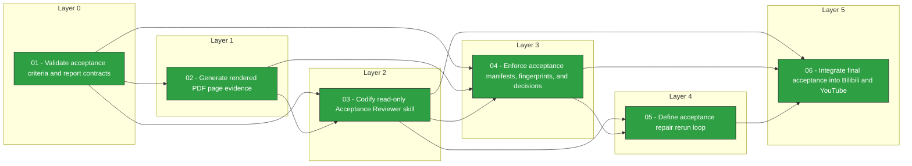

# Issue Dependency View: final-delivery-acceptance-gate

## Consistency errors

None

## Next executable

None

## Waiting on dependencies

None

## Mermaid dependency graph

```mermaid
flowchart LR
  subgraph layer_0["Layer 0"]
    n_01_validate_acceptance_criteria_and_report_contracts["01 - Validate acceptance criteria and report contracts"]
  end
  subgraph layer_1["Layer 1"]
    n_02_generate_rendered_pdf_page_evidence["02 - Generate rendered PDF page evidence"]
  end
  subgraph layer_2["Layer 2"]
    n_03_codify_read_only_acceptance_reviewer_skill["03 - Codify read-only Acceptance Reviewer skill"]
  end
  subgraph layer_3["Layer 3"]
    n_04_enforce_acceptance_manifests_fingerprints_and_decisions["04 - Enforce acceptance manifests, fingerprints, and decisions"]
  end
  subgraph layer_4["Layer 4"]
    n_05_define_acceptance_repair_rerun_loop["05 - Define acceptance repair rerun loop"]
  end
  subgraph layer_5["Layer 5"]
    n_06_integrate_final_acceptance_into_bilibili_and_youtube["06 - Integrate final acceptance into Bilibili and YouTube"]
  end
  n_01_validate_acceptance_criteria_and_report_contracts --> n_02_generate_rendered_pdf_page_evidence
  n_01_validate_acceptance_criteria_and_report_contracts --> n_03_codify_read_only_acceptance_reviewer_skill
  n_02_generate_rendered_pdf_page_evidence --> n_03_codify_read_only_acceptance_reviewer_skill
  n_01_validate_acceptance_criteria_and_report_contracts --> n_04_enforce_acceptance_manifests_fingerprints_and_decisions
  n_02_generate_rendered_pdf_page_evidence --> n_04_enforce_acceptance_manifests_fingerprints_and_decisions
  n_03_codify_read_only_acceptance_reviewer_skill --> n_04_enforce_acceptance_manifests_fingerprints_and_decisions
  n_03_codify_read_only_acceptance_reviewer_skill --> n_05_define_acceptance_repair_rerun_loop
  n_04_enforce_acceptance_manifests_fingerprints_and_decisions --> n_05_define_acceptance_repair_rerun_loop
  n_03_codify_read_only_acceptance_reviewer_skill --> n_06_integrate_final_acceptance_into_bilibili_and_youtube
  n_04_enforce_acceptance_manifests_fingerprints_and_decisions --> n_06_integrate_final_acceptance_into_bilibili_and_youtube
  n_05_define_acceptance_repair_rerun_loop --> n_06_integrate_final_acceptance_into_bilibili_and_youtube
  class n_01_validate_acceptance_criteria_and_report_contracts done
  class n_02_generate_rendered_pdf_page_evidence done
  class n_03_codify_read_only_acceptance_reviewer_skill done
  class n_04_enforce_acceptance_manifests_fingerprints_and_decisions done
  class n_05_define_acceptance_repair_rerun_loop done
  class n_06_integrate_final_acceptance_into_bilibili_and_youtube done
  classDef done fill:#2ea043,stroke:#1f2328,color:#ffffff
  classDef ready_for_agent fill:#0969da,stroke:#1f2328,color:#ffffff
  classDef ready_for_human fill:#8250df,stroke:#1f2328,color:#ffffff
  classDef in_progress fill:#d4a72c,stroke:#1f2328,color:#ffffff
  classDef blocked fill:#cf222e,stroke:#1f2328,color:#ffffff
  classDef in_review fill:#bc4c00,stroke:#1f2328,color:#ffffff
  classDef needs_info fill:#8c959f,stroke:#1f2328,color:#ffffff
  classDef needs_triage fill:#d0d7de,stroke:#1f2328,color:#ffffff
  classDef wontfix fill:#57606a,stroke:#1f2328,color:#ffffff
```
