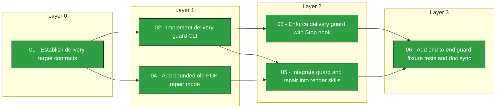

# Issue Dependency View: final-delivery-guard-and-bounded-repair

## Consistency errors

None

## Next executable

None

## Waiting on dependencies

None

## Mermaid dependency graph

```mermaid
flowchart LR
  subgraph layer_0["Layer 0"]
    n_01_establish_delivery_target_contracts["01 - Establish delivery target contracts"]
  end
  subgraph layer_1["Layer 1"]
    n_02_implement_delivery_guard_cli["02 - Implement delivery guard CLI"]
    n_04_add_bounded_old_pdf_repair_mode["04 - Add bounded old PDF repair mode"]
  end
  subgraph layer_2["Layer 2"]
    n_03_enforce_delivery_guard_with_stop_hook["03 - Enforce delivery guard with Stop hook"]
    n_05_integrate_guard_and_repair_into_render_skills["05 - Integrate guard and repair into render skills"]
  end
  subgraph layer_3["Layer 3"]
    n_06_add_end_to_end_guard_fixture_tests_and_doc_sync["06 - Add end to end guard fixture tests and doc sync"]
  end
  n_01_establish_delivery_target_contracts --> n_02_implement_delivery_guard_cli
  n_02_implement_delivery_guard_cli --> n_03_enforce_delivery_guard_with_stop_hook
  n_01_establish_delivery_target_contracts --> n_04_add_bounded_old_pdf_repair_mode
  n_02_implement_delivery_guard_cli --> n_05_integrate_guard_and_repair_into_render_skills
  n_04_add_bounded_old_pdf_repair_mode --> n_05_integrate_guard_and_repair_into_render_skills
  n_03_enforce_delivery_guard_with_stop_hook --> n_06_add_end_to_end_guard_fixture_tests_and_doc_sync
  n_05_integrate_guard_and_repair_into_render_skills --> n_06_add_end_to_end_guard_fixture_tests_and_doc_sync
  class n_01_establish_delivery_target_contracts done
  class n_02_implement_delivery_guard_cli done
  class n_03_enforce_delivery_guard_with_stop_hook done
  class n_04_add_bounded_old_pdf_repair_mode done
  class n_05_integrate_guard_and_repair_into_render_skills done
  class n_06_add_end_to_end_guard_fixture_tests_and_doc_sync done
  classDef done fill:#2ea043,stroke:#1f2328,color:#ffffff
  classDef ready_for_agent fill:#0969da,stroke:#1f2328,color:#ffffff
  classDef ready_for_human fill:#8250df,stroke:#1f2328,color:#ffffff
  classDef in_progress fill:#d4a72c,stroke:#1f2328,color:#ffffff
  classDef blocked fill:#cf222e,stroke:#1f2328,color:#ffffff
  classDef in_review fill:#bc4c00,stroke:#1f2328,color:#ffffff
  classDef needs_info fill:#8c959f,stroke:#1f2328,color:#ffffff
  classDef needs_triage fill:#d0d7de,stroke:#1f2328,color:#ffffff
  classDef wontfix fill:#57606a,stroke:#1f2328,color:#ffffff
```
