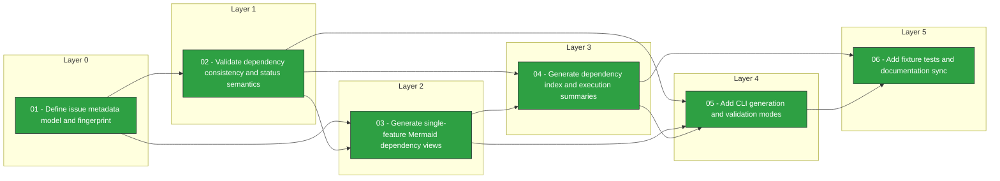

# Issue Dependency View: issue-dependency-views

## Consistency errors

None

## Next executable

None

## Waiting on dependencies

None

## Mermaid dependency graph

```mermaid
flowchart LR
  subgraph layer_0["Layer 0"]
    n_01_define_issue_metadata_model_and_fingerprint["01 - Define issue metadata model and fingerprint"]
  end
  subgraph layer_1["Layer 1"]
    n_02_validate_dependency_consistency_and_status_semantics["02 - Validate dependency consistency and status semantics"]
  end
  subgraph layer_2["Layer 2"]
    n_03_generate_single_feature_mermaid_dependency_views["03 - Generate single-feature Mermaid dependency views"]
  end
  subgraph layer_3["Layer 3"]
    n_04_generate_dependency_index_and_execution_summaries["04 - Generate dependency index and execution summaries"]
  end
  subgraph layer_4["Layer 4"]
    n_05_add_cli_generation_and_validation_modes["05 - Add CLI generation and validation modes"]
  end
  subgraph layer_5["Layer 5"]
    n_06_add_fixture_tests_and_documentation_sync["06 - Add fixture tests and documentation sync"]
  end
  n_01_define_issue_metadata_model_and_fingerprint --> n_02_validate_dependency_consistency_and_status_semantics
  n_01_define_issue_metadata_model_and_fingerprint --> n_03_generate_single_feature_mermaid_dependency_views
  n_02_validate_dependency_consistency_and_status_semantics --> n_03_generate_single_feature_mermaid_dependency_views
  n_02_validate_dependency_consistency_and_status_semantics --> n_04_generate_dependency_index_and_execution_summaries
  n_03_generate_single_feature_mermaid_dependency_views --> n_04_generate_dependency_index_and_execution_summaries
  n_02_validate_dependency_consistency_and_status_semantics --> n_05_add_cli_generation_and_validation_modes
  n_03_generate_single_feature_mermaid_dependency_views --> n_05_add_cli_generation_and_validation_modes
  n_04_generate_dependency_index_and_execution_summaries --> n_05_add_cli_generation_and_validation_modes
  n_04_generate_dependency_index_and_execution_summaries --> n_06_add_fixture_tests_and_documentation_sync
  n_05_add_cli_generation_and_validation_modes --> n_06_add_fixture_tests_and_documentation_sync
  class n_01_define_issue_metadata_model_and_fingerprint done
  class n_02_validate_dependency_consistency_and_status_semantics done
  class n_03_generate_single_feature_mermaid_dependency_views done
  class n_04_generate_dependency_index_and_execution_summaries done
  class n_05_add_cli_generation_and_validation_modes done
  class n_06_add_fixture_tests_and_documentation_sync done
  classDef done fill:#2ea043,stroke:#1f2328,color:#ffffff
  classDef ready_for_agent fill:#0969da,stroke:#1f2328,color:#ffffff
  classDef ready_for_human fill:#8250df,stroke:#1f2328,color:#ffffff
  classDef in_progress fill:#d4a72c,stroke:#1f2328,color:#ffffff
  classDef blocked fill:#cf222e,stroke:#1f2328,color:#ffffff
  classDef in_review fill:#bc4c00,stroke:#1f2328,color:#ffffff
  classDef needs_info fill:#8c959f,stroke:#1f2328,color:#ffffff
  classDef needs_triage fill:#d0d7de,stroke:#1f2328,color:#ffffff
  classDef wontfix fill:#57606a,stroke:#1f2328,color:#ffffff
```
