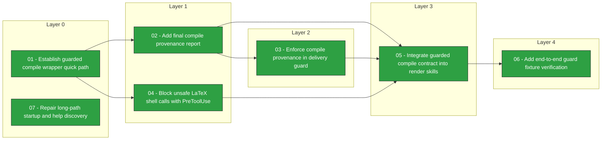

# Issue Dependency View: latex-compile-guard

## Consistency errors

None

## Next executable

None

## Waiting on dependencies

None

## Mermaid dependency graph

```mermaid
flowchart LR
  subgraph layer_0["Layer 0"]
    n_01_establish_guarded_compile_wrapper_quick_path["01 - Establish guarded compile wrapper quick path"]
    n_07_repair_long_path_startup_and_help_discovery["07 - Repair long-path startup and help discovery"]
  end
  subgraph layer_1["Layer 1"]
    n_02_add_final_compile_provenance_report["02 - Add final compile provenance report"]
    n_04_block_unsafe_latex_shell_calls_with_pretooluse["04 - Block unsafe LaTeX shell calls with PreToolUse"]
  end
  subgraph layer_2["Layer 2"]
    n_03_enforce_compile_provenance_in_delivery_guard["03 - Enforce compile provenance in delivery guard"]
  end
  subgraph layer_3["Layer 3"]
    n_05_integrate_guarded_compile_contract_into_render_skills["05 - Integrate guarded compile contract into render skills"]
  end
  subgraph layer_4["Layer 4"]
    n_06_add_end_to_end_guard_fixture_verification["06 - Add end-to-end guard fixture verification"]
  end
  n_01_establish_guarded_compile_wrapper_quick_path --> n_02_add_final_compile_provenance_report
  n_02_add_final_compile_provenance_report --> n_03_enforce_compile_provenance_in_delivery_guard
  n_01_establish_guarded_compile_wrapper_quick_path --> n_04_block_unsafe_latex_shell_calls_with_pretooluse
  n_02_add_final_compile_provenance_report --> n_05_integrate_guarded_compile_contract_into_render_skills
  n_03_enforce_compile_provenance_in_delivery_guard --> n_05_integrate_guarded_compile_contract_into_render_skills
  n_04_block_unsafe_latex_shell_calls_with_pretooluse --> n_05_integrate_guarded_compile_contract_into_render_skills
  n_05_integrate_guarded_compile_contract_into_render_skills --> n_06_add_end_to_end_guard_fixture_verification
  class n_01_establish_guarded_compile_wrapper_quick_path done
  class n_02_add_final_compile_provenance_report done
  class n_03_enforce_compile_provenance_in_delivery_guard done
  class n_04_block_unsafe_latex_shell_calls_with_pretooluse done
  class n_05_integrate_guarded_compile_contract_into_render_skills done
  class n_06_add_end_to_end_guard_fixture_verification done
  class n_07_repair_long_path_startup_and_help_discovery done
  classDef done fill:#2ea043,stroke:#1f2328,color:#ffffff
  classDef ready_for_agent fill:#0969da,stroke:#1f2328,color:#ffffff
  classDef ready_for_human fill:#8250df,stroke:#1f2328,color:#ffffff
  classDef in_progress fill:#d4a72c,stroke:#1f2328,color:#ffffff
  classDef blocked fill:#cf222e,stroke:#1f2328,color:#ffffff
  classDef in_review fill:#bc4c00,stroke:#1f2328,color:#ffffff
  classDef needs_info fill:#8c959f,stroke:#1f2328,color:#ffffff
  classDef needs_triage fill:#d0d7de,stroke:#1f2328,color:#ffffff
  classDef wontfix fill:#57606a,stroke:#1f2328,color:#ffffff
```
