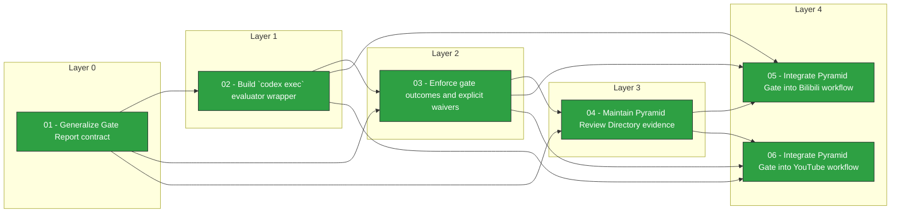

# Issue Dependency View: pyramid-principle-codex-exec-gate

## Consistency errors

None

## Next executable

None

## Waiting on dependencies

None

## Mermaid dependency graph

```mermaid
flowchart LR
  subgraph layer_0["Layer 0"]
    n_01_generalize_gate_report_contract["01 - Generalize Gate Report contract"]
  end
  subgraph layer_1["Layer 1"]
    n_02_build_codex_exec_evaluator_wrapper["02 - Build `codex exec` evaluator wrapper"]
  end
  subgraph layer_2["Layer 2"]
    n_03_enforce_gate_outcomes_and_waivers["03 - Enforce gate outcomes and explicit waivers"]
  end
  subgraph layer_3["Layer 3"]
    n_04_maintain_pyramid_review_directory_evidence["04 - Maintain Pyramid Review Directory evidence"]
  end
  subgraph layer_4["Layer 4"]
    n_05_integrate_pyramid_gate_into_bilibili_workflow["05 - Integrate Pyramid Gate into Bilibili workflow"]
    n_06_integrate_pyramid_gate_into_youtube_workflow["06 - Integrate Pyramid Gate into YouTube workflow"]
  end
  n_01_generalize_gate_report_contract --> n_02_build_codex_exec_evaluator_wrapper
  n_01_generalize_gate_report_contract --> n_03_enforce_gate_outcomes_and_waivers
  n_02_build_codex_exec_evaluator_wrapper --> n_03_enforce_gate_outcomes_and_waivers
  n_01_generalize_gate_report_contract --> n_04_maintain_pyramid_review_directory_evidence
  n_03_enforce_gate_outcomes_and_waivers --> n_04_maintain_pyramid_review_directory_evidence
  n_02_build_codex_exec_evaluator_wrapper --> n_05_integrate_pyramid_gate_into_bilibili_workflow
  n_03_enforce_gate_outcomes_and_waivers --> n_05_integrate_pyramid_gate_into_bilibili_workflow
  n_04_maintain_pyramid_review_directory_evidence --> n_05_integrate_pyramid_gate_into_bilibili_workflow
  n_02_build_codex_exec_evaluator_wrapper --> n_06_integrate_pyramid_gate_into_youtube_workflow
  n_03_enforce_gate_outcomes_and_waivers --> n_06_integrate_pyramid_gate_into_youtube_workflow
  n_04_maintain_pyramid_review_directory_evidence --> n_06_integrate_pyramid_gate_into_youtube_workflow
  class n_01_generalize_gate_report_contract done
  class n_02_build_codex_exec_evaluator_wrapper done
  class n_03_enforce_gate_outcomes_and_waivers done
  class n_04_maintain_pyramid_review_directory_evidence done
  class n_05_integrate_pyramid_gate_into_bilibili_workflow done
  class n_06_integrate_pyramid_gate_into_youtube_workflow done
  classDef done fill:#2ea043,stroke:#1f2328,color:#ffffff
  classDef ready_for_agent fill:#0969da,stroke:#1f2328,color:#ffffff
  classDef ready_for_human fill:#8250df,stroke:#1f2328,color:#ffffff
  classDef in_progress fill:#d4a72c,stroke:#1f2328,color:#ffffff
  classDef blocked fill:#cf222e,stroke:#1f2328,color:#ffffff
  classDef in_review fill:#bc4c00,stroke:#1f2328,color:#ffffff
  classDef needs_info fill:#8c959f,stroke:#1f2328,color:#ffffff
  classDef needs_triage fill:#d0d7de,stroke:#1f2328,color:#ffffff
  classDef wontfix fill:#57606a,stroke:#1f2328,color:#ffffff
```
