# Issue Dependency View: session-scoped-final-delivery-guard

## Consistency errors

None

## Next executable

- [[issues/session-scoped-final-delivery-guard/01-resolve-hook-session-targets-from-official-hook-input]] 01 - Resolve hook session targets from official hook input

## Waiting on dependencies

- [[issues/session-scoped-final-delivery-guard/02-validate-session-scoped-delivery-targets-end-to-end]] waits on [[issues/session-scoped-final-delivery-guard/01-resolve-hook-session-targets-from-official-hook-input]]
- [[issues/session-scoped-final-delivery-guard/03-add-delivery-task-index-ownership-and-handoff-checks]] waits on [[issues/session-scoped-final-delivery-guard/01-resolve-hook-session-targets-from-official-hook-input]]
- [[issues/session-scoped-final-delivery-guard/04-convert-old-pdf-prepare-and-failed-attempt-lifecycle]] waits on [[issues/session-scoped-final-delivery-guard/02-validate-session-scoped-delivery-targets-end-to-end]], [[issues/session-scoped-final-delivery-guard/03-add-delivery-task-index-ownership-and-handoff-checks]]
- [[issues/session-scoped-final-delivery-guard/05-archive-delivered-session-targets-and-update-task-index]] waits on [[issues/session-scoped-final-delivery-guard/03-add-delivery-task-index-ownership-and-handoff-checks]], [[issues/session-scoped-final-delivery-guard/04-convert-old-pdf-prepare-and-failed-attempt-lifecycle]]
- [[issues/session-scoped-final-delivery-guard/06-update-render-skills-and-project-instructions]] waits on [[issues/session-scoped-final-delivery-guard/02-validate-session-scoped-delivery-targets-end-to-end]], [[issues/session-scoped-final-delivery-guard/03-add-delivery-task-index-ownership-and-handoff-checks]], [[issues/session-scoped-final-delivery-guard/04-convert-old-pdf-prepare-and-failed-attempt-lifecycle]], [[issues/session-scoped-final-delivery-guard/05-archive-delivered-session-targets-and-update-task-index]]
- [[issues/session-scoped-final-delivery-guard/07-add-concurrent-session-regression-fixtures]] waits on [[issues/session-scoped-final-delivery-guard/01-resolve-hook-session-targets-from-official-hook-input]], [[issues/session-scoped-final-delivery-guard/02-validate-session-scoped-delivery-targets-end-to-end]], [[issues/session-scoped-final-delivery-guard/03-add-delivery-task-index-ownership-and-handoff-checks]], [[issues/session-scoped-final-delivery-guard/04-convert-old-pdf-prepare-and-failed-attempt-lifecycle]], [[issues/session-scoped-final-delivery-guard/05-archive-delivered-session-targets-and-update-task-index]], [[issues/session-scoped-final-delivery-guard/06-update-render-skills-and-project-instructions]]

## Mermaid dependency graph

```mermaid
flowchart LR
  subgraph layer_0["Layer 0"]
    n_01_resolve_hook_session_targets_from_official_hook_input["01 - Resolve hook session targets from official hook input"]
  end
  subgraph layer_1["Layer 1"]
    n_02_validate_session_scoped_delivery_targets_end_to_end["02 - Validate session-scoped delivery targets end to end"]
    n_03_add_delivery_task_index_ownership_and_handoff_checks["03 - Add delivery task index ownership and handoff checks"]
  end
  subgraph layer_2["Layer 2"]
    n_04_convert_old_pdf_prepare_and_failed_attempt_lifecycle["04 - Convert old-PDF prepare and failed-attempt lifecycle"]
  end
  subgraph layer_3["Layer 3"]
    n_05_archive_delivered_session_targets_and_update_task_index["05 - Archive delivered session targets and update task index"]
  end
  subgraph layer_4["Layer 4"]
    n_06_update_render_skills_and_project_instructions["06 - Update render skills and project instructions"]
  end
  subgraph layer_5["Layer 5"]
    n_07_add_concurrent_session_regression_fixtures["07 - Add concurrent-session regression fixtures"]
  end
  n_01_resolve_hook_session_targets_from_official_hook_input --> n_02_validate_session_scoped_delivery_targets_end_to_end
  n_01_resolve_hook_session_targets_from_official_hook_input --> n_03_add_delivery_task_index_ownership_and_handoff_checks
  n_02_validate_session_scoped_delivery_targets_end_to_end --> n_04_convert_old_pdf_prepare_and_failed_attempt_lifecycle
  n_03_add_delivery_task_index_ownership_and_handoff_checks --> n_04_convert_old_pdf_prepare_and_failed_attempt_lifecycle
  n_03_add_delivery_task_index_ownership_and_handoff_checks --> n_05_archive_delivered_session_targets_and_update_task_index
  n_04_convert_old_pdf_prepare_and_failed_attempt_lifecycle --> n_05_archive_delivered_session_targets_and_update_task_index
  n_02_validate_session_scoped_delivery_targets_end_to_end --> n_06_update_render_skills_and_project_instructions
  n_03_add_delivery_task_index_ownership_and_handoff_checks --> n_06_update_render_skills_and_project_instructions
  n_04_convert_old_pdf_prepare_and_failed_attempt_lifecycle --> n_06_update_render_skills_and_project_instructions
  n_05_archive_delivered_session_targets_and_update_task_index --> n_06_update_render_skills_and_project_instructions
  n_01_resolve_hook_session_targets_from_official_hook_input --> n_07_add_concurrent_session_regression_fixtures
  n_02_validate_session_scoped_delivery_targets_end_to_end --> n_07_add_concurrent_session_regression_fixtures
  n_03_add_delivery_task_index_ownership_and_handoff_checks --> n_07_add_concurrent_session_regression_fixtures
  n_04_convert_old_pdf_prepare_and_failed_attempt_lifecycle --> n_07_add_concurrent_session_regression_fixtures
  n_05_archive_delivered_session_targets_and_update_task_index --> n_07_add_concurrent_session_regression_fixtures
  n_06_update_render_skills_and_project_instructions --> n_07_add_concurrent_session_regression_fixtures
  class n_01_resolve_hook_session_targets_from_official_hook_input ready_for_agent
  class n_02_validate_session_scoped_delivery_targets_end_to_end ready_for_agent
  class n_03_add_delivery_task_index_ownership_and_handoff_checks ready_for_agent
  class n_04_convert_old_pdf_prepare_and_failed_attempt_lifecycle ready_for_agent
  class n_05_archive_delivered_session_targets_and_update_task_index ready_for_agent
  class n_06_update_render_skills_and_project_instructions ready_for_agent
  class n_07_add_concurrent_session_regression_fixtures ready_for_agent
  classDef done fill:#2ea043,stroke:#1f2328,color:#ffffff
  classDef ready_for_agent fill:#0969da,stroke:#1f2328,color:#ffffff
  classDef ready_for_human fill:#8250df,stroke:#1f2328,color:#ffffff
  classDef in_progress fill:#d4a72c,stroke:#1f2328,color:#ffffff
  classDef blocked fill:#cf222e,stroke:#1f2328,color:#ffffff
  classDef in_review fill:#bc4c00,stroke:#1f2328,color:#ffffff
  classDef needs_info fill:#8c959f,stroke:#1f2328,color:#ffffff
  classDef needs_triage fill:#d0d7de,stroke:#1f2328,color:#ffffff
  classDef wontfix fill:#57606a,stroke:#1f2328,color:#ffffff
```

